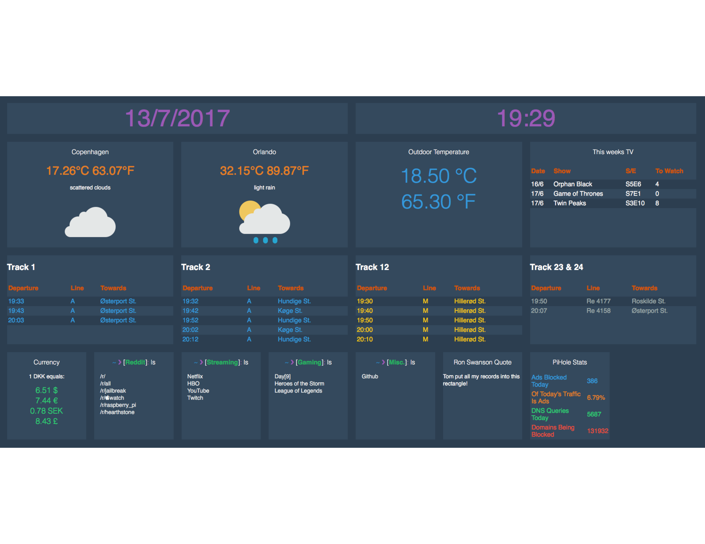

# Dashboard

Simple responsive html dashboard that works on mobile and desktop. 

## Getting started

There is a lot of different api's used in the project, so lets go through them and make sure they are all in place, before forking the project. 

### Prerequisites

There are lots of various files used to get data from different websites. I'll go through them one at a time. 

#### getCalendar.php

> Get tv shows airing this week from Trakt.tv and number of unwatched episodes.

In order to get trakt.tv information you need: 
	
    $TOKEN = "xxx";
	$APIKEY = "xxx";

I used the Authentication - Devices method found [here](http://docs.trakt.apiary.io/#reference/authentication-devices).

#### getCurrency.php

> Get exchange values based on a single currency. 

Chance the base url ``http://api.fixer.io/latest?base=DKK`` to whatever currecy you want. 

#### getPiHole.php

> Get [PiHole](https://pi-hole.net) stats for the last 24 hours. 

Change the base url to whatever url your pihole is running. I use the hostname ``pivpn`` but you can change it to whatever.

#### getTemp.php

> Get the current outdoor temperature. 

I use a wemos D1 mini with a one-wire temperature sensor. Change the url in the file to whatever you like or use. 

Make sure the result is in json like the example:

	{
    	"Temperature": { 
        	"Celsius": " xx.xx ", 
            "Fahrenheit": " xx.xx " 
        }
    }

#### getTrain.php

> Get current train information from [rejseplanen](http://labs.rejseplanen.dk/labs/api/).

Get the api url from the link above and change the ``departureBoard`` to whatever station is closest to you. 

#### javascript.js

The main javascript file. To get weather information get your apikey from openweathermap.org. Change cities as you like. 

From openweathermap also make sure to grab icons for all the weather types. 

### Pace.js

As we are loading a lot of information I like to have a loading bar. For that I use [pace.js](http://github.hubspot.com/pace/docs/welcome/). 

Download the javascript file and add it to your folder. Then in the pace.css file add:

	.pace-running > *:not(.pace) {
    	display: none;
    }
    
This will make sure the website isn't displaying anything before everything is loaded. 

In the javascript.js file include 

	
	<link rel="stylesheet" type="text/css" href="pace.css">
    
## Acknowledgments

- [pace.js](http://github.hubspot.com/pace/docs/welcome/).
- [flatuicolors.com](https://flatuicolors.com)
- [Responsive Grid System](http://www.responsivegridsystem.com)

## License

This project is licensed under the MIT License - see the LICENSE.md file for details
